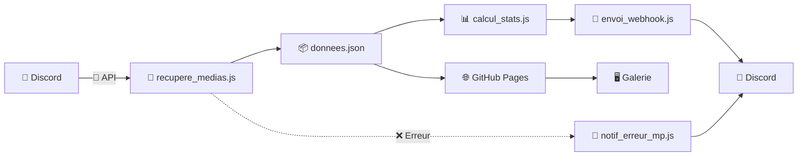

🌌 Discord Media Gallery

🤖 Discord → ⚙️ GitHub Actions → 📦 JSON → 🌐 GitHub Pages

  

  
  
  
  
  

 «Une galerie multimédia automatique alimentée directement par Discord.»

"🌐 Voir la galerie" (https://nathan-pro-fr.github.io/Discord_Github_Action/) •
"⚙️ GitHub Actions" (https://github.com/Nathan-Pro-FR/Discord_Github_Action/actions) •
"🐛 Signaler un problème" (https://github.com/Nathan-Pro-FR/Discord_Github_Action/issues)

 
---

🛰️ Présentation

Discord Media Gallery permet de transformer un salon Discord en source de contenu pour une galerie web moderne.

Le projet automatise toute la chaîne :

💬 Discord
    │
    │ 📡 Discord API
    ▼
🤖 Node.js
    │
    │ 🔄 Synchronisation
    ▼
📦 donnees.json
    │
    ├───────────────► 📊 Statistiques
    │
    ▼
🌐 GitHub Pages
    │
    ▼
🖼️ Galerie Web

Aucun serveur backend permanent n'est nécessaire.

---

✨ Fonctionnalités

Fonctionnalité| Description
🤖 Synchronisation automatique| Récupération des médias depuis Discord
🖼️ Images & vidéos| Affichage des médias récupérés
⚙️ GitHub Actions| Automatisation complète du processus
📦 JSON| Stockage simple et statique des données
📊 Statistiques| Détection des ajouts, suppressions et rafraîchissements
🔔 Discord Webhook| Rapport automatique après synchronisation
🚨 Alertes d'erreur| Notification Discord en cas d'échec
🌐 GitHub Pages| Hébergement gratuit de la galerie
🎨 Cyberpunk UI| Interface Dark Neon responsive
📱 Responsive| Compatible desktop et mobile

---

🎞️ Preview

🌐 "Ouvrir la galerie" (https://nathan-pro-fr.github.io/Discord_Github_Action/)

«💡 Note : ajoute ton GIF de démonstration dans "docs/preview.gif".»

Si tu n'as pas encore de GIF, tu peux temporairement supprimer cette section.

---

🧬 Architecture

---

🔄 Fonctionnement

1. 💬 Discord

Un bot Discord possède accès au salon contenant les médias.

Il récupère les messages et leurs pièces jointes via l'API Discord.

💬 Discord
   │
   ├── 🖼️ Image
   ├── 🖼️ Image
   ├── 🎥 Vidéo
   └── 🖼️ Image

---

2. 🤖 Synchronisation

"recupere_medias.js" récupère les médias et génère :

📦 donnees.json

---

3. 📊 Analyse

"calcul_stats.js" compare les anciennes données avec les nouvelles.

📦 donnees.previous.json
          │
          │ 🔍 comparaison
          ▼
   📊 calcul_stats.js
          ▲
          │
     📦 donnees.json

Le système détecte :

- ➕ médias ajoutés
- ➖ médias supprimés
- 🔄 URLs rafraîchies
- 📦 nombre total de médias

---

4. 🔔 Notification

"envoi_webhook.js" envoie un rapport à Discord.

Exemple :

╭──────────────────────────────────╮
│       🔄 GALERIE SYNCHRONISÉE    │
├──────────────────────────────────┤
│                                  │
│  ➕ Ajoutés       : 12            │
│  ➖ Supprimés     : 2             │
│  🔄 Rafraîchis    : 4             │
│  📦 Total         : 158           │
│                                  │
│  🟢 Synchronisation réussie      │
╰──────────────────────────────────╯

---

⚙️ GitHub Actions

Le workflow principal se trouve ici :

.github/workflows/sync_discord.yml

Il peut être exécuté :

- ⏰ automatiquement
- ▶️ manuellement
- 🚨 en réaction à une erreur

⏰ Synchronisation automatique

on:
  schedule:
    - cron: "0 */12 * * *"

  workflow_dispatch:

La synchronisation est donc programmée toutes les 12 heures.

---

🔁 Pipeline CI/CD

flowchart TD
    A["⏰ Schedule / Manual"] --> B["📥 Checkout"]
    B --> C["🟢 Node.js"]
    C --> D["📦 npm install"]
    D --> E["💾 Backup"]
    E --> F["💬 Fetch Discord Media"]
    F --> G["📊 Calculate Stats"]
    G --> H["🔔 Discord Webhook"]
    H --> I{"📦 Données modifiées ?"}

    I -->|"Oui"| J["💾 Git Commit"]
    J --> K["🚀 Git Push"]

    I -->|"Non"| L["⏭️ Aucun commit"]

    K --> M["✅ Terminé"]
    L --> M

    F -.->|"❌ Erreur"| N["🚨 Error Notification"]
    G -.->|"❌ Erreur"| N
    H -.->|"❌ Erreur"| N

    N --> O["💬 Discord"]

---

🧰 Stack technique

Technologie| Utilisation
🟨 JavaScript| Logique applicative
🟢 Node.js| Exécution des scripts
🟦 HTML5| Structure du frontend
🎨 CSS3| Design
📦 JSON| Données
⚙️ GitHub Actions| CI/CD
💬 Discord API| Collecte
🔔 Discord Webhooks| Notifications
🌐 GitHub Pages| Hébergement
🐙 Git| Versionnement

---

📁 Structure du projet

Discord_Github_Action/
│
├── .github/
│   └── workflows/
│       └── sync_discord.yml
│
├── css/
│   └── style.css
│
├── docs/
│   └── preview.gif
│
├── image/
│
├── calcul_stats.js
├── donnees.json
├── dashboard.html
├── envoi_webhook.js
├── index.html
├── manifest.json
├── notif_erreur_mp.js
├── package.json
├── recupere_medias.js
├── script.js
├── sw.js
│
├── README.md
├── README.fr.md
├── README.pro.md
├── SECURITY.md
├── CODE_OF_CONDUCT.md
└── LICENSE

---

🤖 Scripts Node.js

"recupere_medias.js"

Le cœur de la synchronisation.

💬 Discord
    ↓
📡 API
    ↓
🤖 recupere_medias.js
    ↓
📦 donnees.json

Commande :

npm run sync

---

"calcul_stats.js"

Compare les datasets et génère les statistiques.

npm run stats

Outputs :

➕ added
➖ removed
🔄 refreshed
📦 total

---

"envoi_webhook.js"

Envoie le rapport de synchronisation à Discord.

npm run webhook

---

"notif_erreur_mp.js"

Gère les notifications en cas d'échec.

npm run notify-error

---

🖥️ Frontend

Le frontend utilise :

🌐 HTML5
   +
⚡ JavaScript
   +
🎨 CSS3
   +
📦 JSON

"index.html"

Structure principale de la galerie.

"script.js"

Responsable notamment de :

- 📥 charger "donnees.json"
- 🖼️ créer les images
- 🎥 créer les vidéos
- 🧱 construire la galerie
- ⚠️ gérer les erreurs
- 🖱️ gérer les interactions

"css/style.css"

Responsable du thème :

🌌 Dark
💠 Neon
⚡ Animations
🟣 Cyberpunk
📱 Responsive

---

📊 Statistiques

Le moteur de statistiques compare :

             AVANT
               │
               ▼
    📦 donnees.previous.json
               │
               │
               │ 🔍
               ▼
       📊 COMPARAISON
               ▲
               │
               │
               ▼
     📦 donnees.json
               │
               ▼
             APRÈS

Exemple

╔════════════════════════════════╗
║          📊 SYNC REPORT        ║
╠════════════════════════════════╣
║                                ║
║  ➕ ADDED       12              ║
║  ➖ REMOVED      2              ║
║  🔄 REFRESHED    4              ║
║  📦 TOTAL      158              ║
║                                ║
║  🟢 STATUS: SUCCESS             ║
╚════════════════════════════════╝

---

🔐 Configuration

Les secrets GitHub se trouvent dans :

Settings → Secrets and variables → Actions

Variables utilisées :

Secret| Requis| Rôle
"DISCORD_TOKEN"| 🔴| Token du bot
"CHANNEL_ID"| 🔴| ID du salon Discord
"DISCORD_WEBHOOK_URL"| 🟡| Webhook de notification
"DISCORD_USER_ID"| 🟡| Utilisateur pour les alertes

---

🛡️ Sécurité

❌ Ne faites jamais ceci

const token = "MON_TOKEN_DISCORD";

✅ Utilisez GitHub Secrets

env:
  DISCORD_TOKEN: ${{ secrets.DISCORD_TOKEN }}

Le token Discord ne doit jamais être :

- ❌ dans le code
- ❌ dans le README
- ❌ dans un commit Git
- ❌ dans "package.json"
- ❌ dans un fichier public

«🚨 Si un token Discord est accidentellement publié, il doit être révoqué immédiatement.»

Pour plus d'informations, consultez ""SECURITY.md"" (SECURITY.md).

---

💻 Installation locale

1. 📥 Cloner

git clone https://github.com/Nathan-Pro-FR/Discord_Github_Action.git
cd Discord_Github_Action

2. 📦 Installer

npm install

3. 🔐 Configurer

Linux / macOS

export DISCORD_TOKEN="your_token"
export CHANNEL_ID="your_channel_id"

Windows PowerShell

$env:DISCORD_TOKEN="your_token"
$env:CHANNEL_ID="your_channel_id"

4. ▶️ Lancer

npm run sync

---

📦 Commandes npm

Commande| Action
"npm run sync"| 🤖 Synchronisation Discord
"npm run stats"| 📊 Calcul des statistiques
"npm run webhook"| 🔔 Envoi du webhook
"npm run notify-error"| 🚨 Notification d'erreur

---

🌐 GitHub Pages

La galerie fonctionne comme un site statique.

🐙 GitHub
   │
   ├── 🌐 index.html
   ├── ⚡ script.js
   ├── 🎨 style.css
   └── 📦 donnees.json
            │
            ▼
      🌐 GitHub Pages
            │
            ▼
         👤 Visiteur

Aucun backend permanent n'est requis pour afficher la galerie.

---

🎨 Cyberpunk Experience

L'interface est pensée autour d'une ambiance :

╔══════════════════════════════════════╗
║                                      ║
║          SYSTEM ONLINE               ║
║                                      ║
║       ████████████████████           ║
║       █  MEDIA DATABASE  █           ║
║       ████████████████████           ║
║                                      ║
║          STATUS: 🟢 ONLINE           ║
║                                      ║
╚══════════════════════════════════════╝

🌌 Design

- 🌑 Dark background
- 💠 Neon glow
- ⚡ Animations
- 🟣 Cyberpunk aesthetic
- 📱 Responsive layout
- 🖼️ Media-focused interface

---

🗺️ Roadmap

✅ Discord Media Sync
✅ GitHub Actions
✅ JSON generation
✅ Statistics engine
✅ Discord Webhooks
✅ Error notifications
✅ GitHub Pages
✅ Cyberpunk UI

🔲 Advanced filtering
🔲 Infinite scroll
🔲 Lightbox
🔲 Thumbnail optimization
🔲 Advanced dashboard
🔲 More media providers

---

📚 Documentation

Document| Description
📖 ""README.md"" (README.md)| Documentation principale
🇫🇷 ""README.fr.md"" (README.fr.md)| Documentation française
📚 ""README.pro.md"" (README.pro.md)| Documentation professionnelle
🏗️ ""docs/ARCHITECTURE.md"" (docs/ARCHITECTURE.md)| Architecture technique
🔐 ""SECURITY.md"" (SECURITY.md)| Sécurité
🤝 ""CODE_OF_CONDUCT.md"" (CODE_OF_CONDUCT.md)| Code de conduite
📜 ""LICENSE"" (LICENSE)| Licence

---

⭐ Support

Si le projet vous plaît ou vous est utile :

""GitHub Stars" (https://img.shields.io/github/stars/Nathan-Pro-FR/Discord_Github_Action?style=for-the-badge&logo=github&label=STARS)" (https://github.com/Nathan-Pro-FR/Discord_Github_Action/stargazers)

""Issues" (https://img.shields.io/github/issues/Nathan-Pro-FR/Discord_Github_Action?style=for-the-badge&logo=github)" (https://github.com/Nathan-Pro-FR/Discord_Github_Action/issues)

""Pull Requests" (https://img.shields.io/github/issues-pr/Nathan-Pro-FR/Discord_Github_Action?style=for-the-badge&logo=github)" (https://github.com/Nathan-Pro-FR/Discord_Github_Action/pulls)

 ⭐ Star le projet

🐛 Signaler un bug

💡 Proposer une fonctionnalité

🔀 Contribuer

---

📜 Licence

Ce projet est distribué sous licence MIT.

Voir ""LICENSE"" (LICENSE) pour les conditions complètes.

---

🌌 Discord Media Gallery

"SYSTEM ONLINE" • "MEDIA SYNC" • "CYBERPUNK UI"

Made with 💜 by "Nathan-Pro-FR" (https://github.com/Nathan-Pro-FR)

 ⚡ Discord → GitHub Actions → JSON → GitHub Pages ⚡

